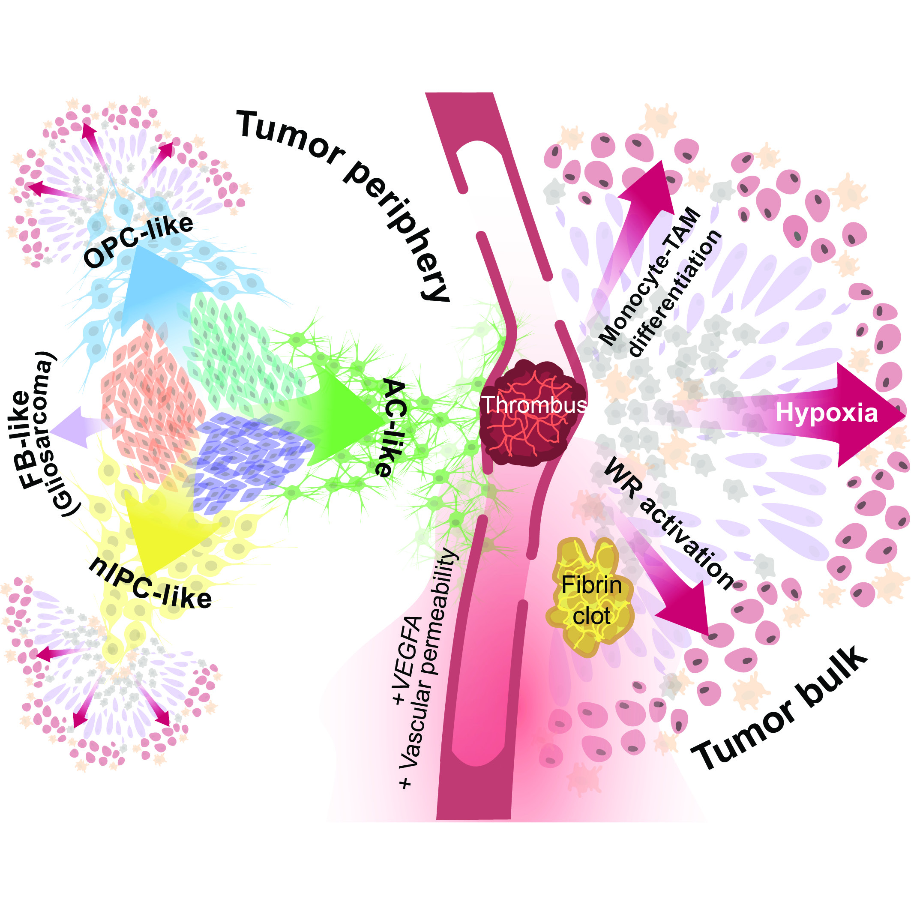

# Futile wound healing drives mesenchymal-like cell phenotypes in human glioblastoma
*(In review)*.

## Download the m-cell gene expression matrix with polygons and coordinates

[EEL gene expression matrix](https://storage.googleapis.com/linnarsson-lab-glioblastoma/EEL/DataSubmission/GBM_Linnarsson_EEL.h5ad).

We use the [FISHscale](https://github.com/linnarsson-lab/FISHscale) pipeline for unsupervised cell-free segmentation (m-states). We use the [FISHspace](https://github.com/linnarsson-lab/FISHspace) software for plotting m-cells and further analysis. FISHspace software is based on stlearn (https://stlearn.readthedocs.io/en/latest/) with added plotting and processing functions.

[Organoid expression matrix](https://storage.googleapis.com/linnarsson-lab-glioblastoma/EEL/DataSubmission/SL_OrganoidExperiment.h5ad).

[Organoid scIV integrated expression matrix](https://storage.googleapis.com/linnarsson-lab-glioblastoma/EEL/DataSubmission/GBMOrganoids_scVIsurgery20240408.h5ad).

## Download the molecules spatial coordinates
For the visualization of [Molecules Spatial Coordinates](https://storage.googleapis.com/linnarsson-lab-glioblastoma/EEL/DataSubmission/MoleculesLibrary.tar.gz) we recommend to use [FISHscale](https://github.com/linnarsson-lab/FISHscale). FISHscale visualizer is based upon Open3D, allowing for blazing fast visualization of datasets of millions of RNA molecules. 

